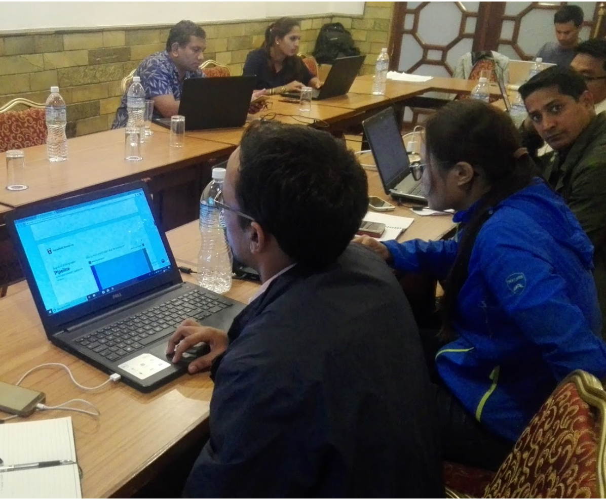

Field Note #2
=============

**Date**: Jul 25, 2018 | **Venue**: Kathmandu

**User Profile**:

+-------------------+------------------------------------------------------------------------------------------------------------------------------------------------------------------------------------------------+
| **Category**      | Civil Society Organization                                                                                                                                                                     |
+-------------------+------------------------------------------------------------------------------------------------------------------------------------------------------------------------------------------------+
| **Working areas** | Nuwakot, Rasuwa (CSO 1) and Chitwan, Makwanpur (CSO 2)                                                                                                                                         |
+-------------------+------------------------------------------------------------------------------------------------------------------------------------------------------------------------------------------------+
| **User roles**    | 9 people from 2 CSOs participated in this requirement analysis exercise. Most of the participants were field personnel; also had a few program heads.                                          |
+-------------------+------------------------------------------------------------------------------------------------------------------------------------------------------------------------------------------------+
| **User level**    | Intermediate in using ODP-like online tool                                                                                                                                                     |
+-------------------+------------------------------------------------------------------------------------------------------------------------------------------------------------------------------------------------+

**Meeting Notes**:

- **End User Data Needs and Information Flow**

    *What are their typical information needs?*

      Migration, agriculture, education, health related data are mostly useful to them. They use such data for project proposals, planning and reporting. They also use data to make different types of comparisons (temporal, geographical, etc.) They also need data according to new admin boundaries (Gaunpalika and Nagarpalika structure) but they are difficult to find.

    *Who within the organization seek the kind of information provided by ODP?*

      Mostly program/project staff who are working on planning and reporting.

    *How do they solicit, collect such information?*

      They too choose government authenticated data (like CBS data) as first choice. However, most of them were reported to be outdated. Hence they sometimes deploy their own data collection teams. Most often, they use other online data sources (mostly government sites).

      The information seekers (mostly program heads) were also the ultimate users of such data. They might assign data collection tasks as such to their subordinates (in case of fresh data collection). Otherwise, they are the ones who feel the need of data, search them online and ultimately use them for various project purposes.

    *Where do these demands come from?*

      Mostly donor/project driven.

- **ODP Feedback (As told by the participants)**

   - “We often have to look for the latest socio-demographic data for writing reports, etc. Currently we either conduct our own survey or visit different offices for secondary data. Most often we have to use the census data, which is old and not available in new Gaunpalika-Nagarpalika structures.” - Various members from CDC Nepal and DEC Nepal.

   - “Add agriculture and health data layers as well.”

   - “Do we need to be online to use this? Is there a way to make these visualizations possible in offline mode as well?” - Laxmi Phuyal, Program Coordinator, CDC Nepal.

   - “It would be nice to be able to compare two or more units.” - Pankaj Raj Devkota, Project Director, DEC Nepal.

      *Apparently, this feature already exists but it currently requires users to click a district/palika on the map, which none of them knew was possible. Therefore, it might be better to add Compare <district> to other districts button visible as soon as they select a district from the dropdown list.
      However, this still does not tell users that they can click on individual palikas on the map. Changing the cursor to click_type when hovering on a clickable object on the map might help.*

- **ODP Feedback (As observed by KLL)**

   - The need for multivariate analyses was not expressed even when prompted with examples. They have not used (and see a need for) such analyses in their work.
   - The three dots (more info button) at the top right of each chart in the GENERATE section is not intuitive. Subjects are not aware this is an action button.
   - Most people failed to notice that EXPLORE, GENERATE and DOWNLOAD are action buttons on the landing page.

