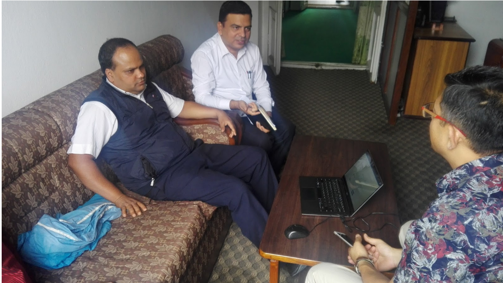

Field Note #3
=============

**Date**: Aug 1, 2018 | **Venue**: National Reconstruction Authority, Singh Durbar, Kathmandu

**User Profile**:

+-------------------+----------------------------------------------------------------------------------------------------------------------------------------------------------------------------------------------------------------------------------------+
| **Category**      | Central Government Unit                                                                                                                                                                                                                |
+-------------------+----------------------------------------------------------------------------------------------------------------------------------------------------------------------------------------------------------------------------------------+
| **Working areas** | All earthquake affected districts in Nepal                                                                                                                                                                                             |
+-------------------+----------------------------------------------------------------------------------------------------------------------------------------------------------------------------------------------------------------------------------------+
| **User roles**    | 1 Under Secretary and 2 senior officials from NRA participated in this requirement analysis exercise. All three were heavily involved in the massive post-earthquake survey conducted to collect data which power the current ODP site.|
+-------------------+----------------------------------------------------------------------------------------------------------------------------------------------------------------------------------------------------------------------------------------+
| **User level**    | Expert in using ODP-like online tool                                                                                                                                                                                                   |
+-------------------+----------------------------------------------------------------------------------------------------------------------------------------------------------------------------------------------------------------------------------------+

**Meeting Notes**:

- **End User Data Needs and Information Flow**

    *What are their typical information needs?*

      Data on building damage. However, NRA has already used the data currently powering the ODP site to publish the first list of identified beneficiaries back in 2016. However, they do find the presentation of data on ODP useful and more user-friendly.

- **ODP Feedback (As told by the participants)**

   - “NRA will mention/promote this portal to the audience in their upcoming programs. KLL should promote this visualization tool.” - Manohar Ghimire, Under Secretary.

   - “Add a notice stating that this is data collected during the earthquake.” - Manohar Ghimire, Under Secretary.

- **ODP Feedback (As observed by KLL)**

   - NRA expressed its concern over the quality of certain survey data (original data - not the data on this portal). They suspect that not all of these data accurately reflect the true picture on the ground because these data were collected during ‘abnormal’ times. However, they do acknowledge that most of the data elements like those related to education, migration, social security, etc. are comparatively of better quality and still very useful.
   - They suggested to compare this data with other sources of data e.g. census 2011 to see how good this data is and get more confidence.

